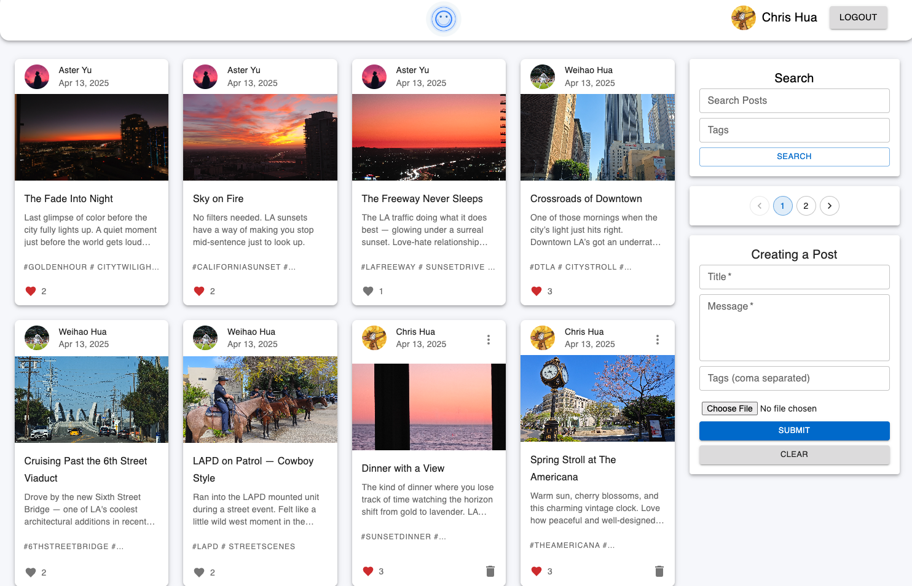
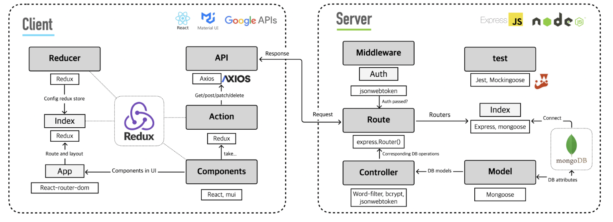

# LA Moments: A MERN-Based Lifestyle Photo Blogging Platform

**LA Moments** is a curated visual diary that celebrates the essence of Los Angeles life — from quiet street corners to iconic sunsets. It offers a simple, elegant interface for discovering and sharing personal stories through images.

---


## Demo



- Users can **create** and **modify** their own blog posts, as well as **search**, leave **comments** on, and upvote content across the platform (limited to one upvote per user per blog)
- Integration with **Google Account OAuth** https://console.cloud.google.com/apis alongside traditional username/password authentication
- Implementation of the Aho-Corasick Algorithm for content moderation and **filtering of sensitive language**
- Protection against traffic spikes and potential attacks through **IP-based rate limiting**
- Enhanced database performance via **pagination** and strategic **database index** implementation
- Streamlined development workflow with **CI/CD** integration and comprehensive **testing** frameworks

---


## Tech Structure



---


## Getting Started (with Docker 🐳)

### Prerequisites

To run `SkyLens`, you'll need:

- [Docker](https://www.docker.com/) and [Docker Compose](https://docs.docker.com/compose/)
- [MongoDB Atlas](https://www.mongodb.com/atlas/database) or a local MongoDB instance
- [Google API Client ID](https://console.cloud.google.com/apis) for Google OAuth login

### Setup Instructions

1. Create two `.env` files in the `client/` and `server/` folders, using the provided `.env.example` files as templates.

#### Example: `client/.env`
```env
REACT_APP_API_URL=http://localhost:8080/api
REACT_APP_GOOGLE_CLIENT_ID=your-google-client-id
```

#### Example: `server/.env`

```
PORT=8080
MONGODB_URI=mongodb://your-mongodb-uri
GOOGLE_CLIENT_ID=your-google-client-id
JWT_SECRET=your-secret
```


2. In the root directory, build and start all services:

```bash
docker-compose up -d --build
```


3. Access the app: http://localhost


## Alternative Manual Setup (Node + React)

If you prefer to run without Docker:

1. Install dependencies for the backend:

```bash
cd server
npm install
npm start
```

2. In a second terminal, install and run the frontend:

```bash
cd client
npm install --legacy-peer-deps
npm start
```

3. The frontend will run at `http://localhost:3000`

